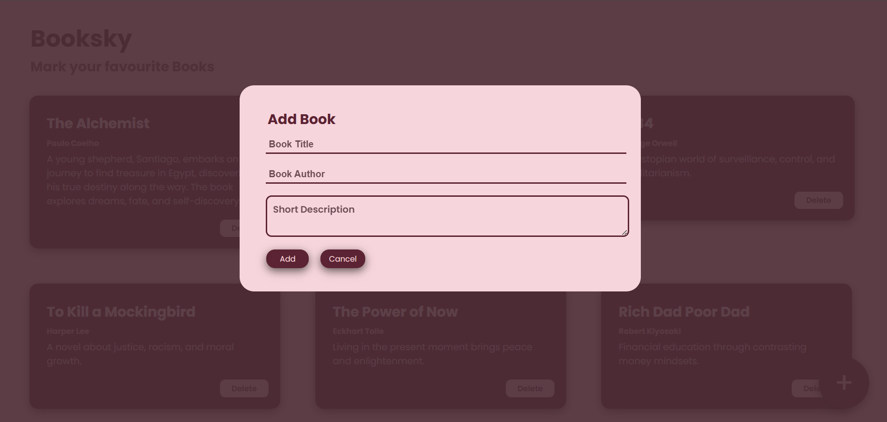

# 📚 Booksky - Mark Your Favourite Books

Welcome to **Booksky**, a simple web application that allows you to add, view, and manage your favorite books. 📖✨

## 🚀 Features
- 📌 Add books with title, author, and description.
- 🗑️ Delete books from the list.
- 🎨 Responsive and beautiful UI.

## 🛠️ Installation
To use this project, follow these steps:

git clone https://github.com/Aneeq-vector/booksky.git
cd booksky
code .

## 🖥️ Usage
- Click the **Add** button to enter book details.
- Press **Delete** to remove a book.
- Enjoy organizing your book collection! 🎉

## 🖌️ Technologies Used
- HTML5  
- CSS3  
- JavaScript  

## 📸 Screenshot

## 👨‍💻 Author
- **Aneeq Ahmed**  
  - 🔗 [GitHub](https://github.com/Aneeq-vector)
  - 🔗 [LinkedIn](https://www.linkedin.com/in/ahmed-aneeq-b8b073325/)
